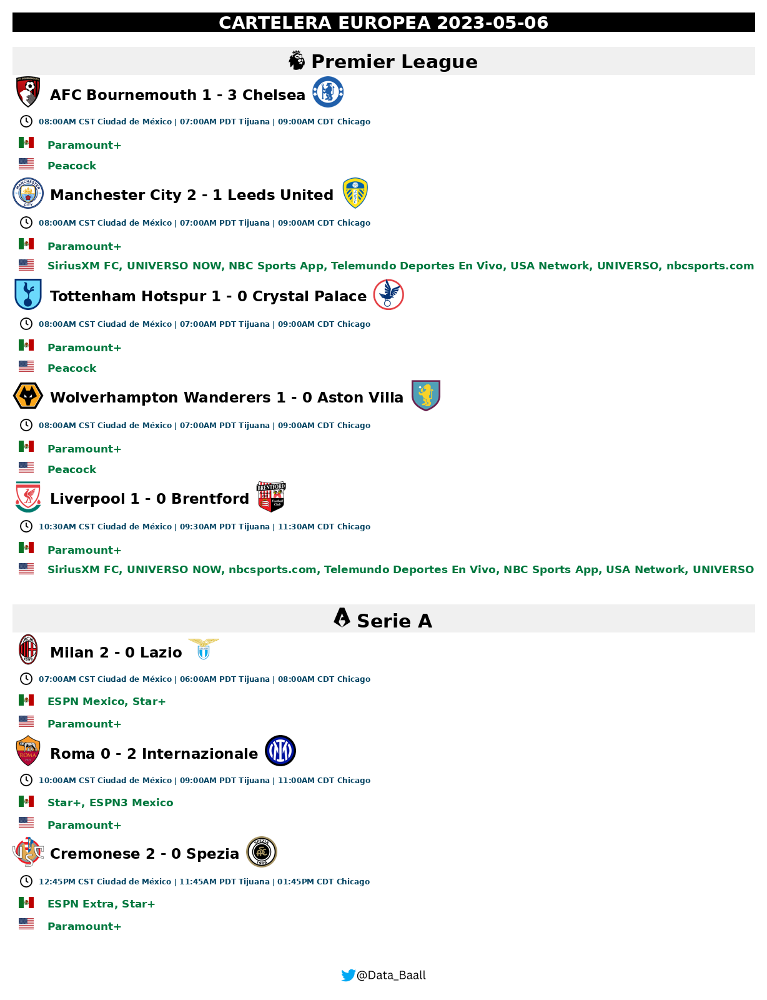
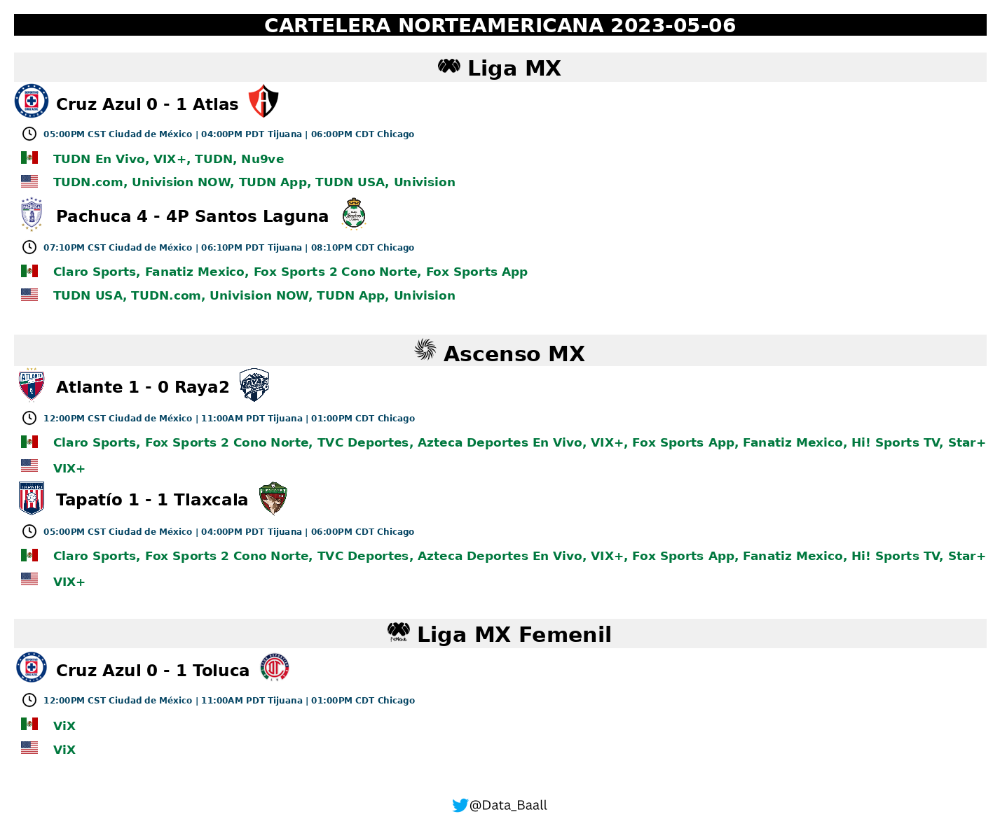
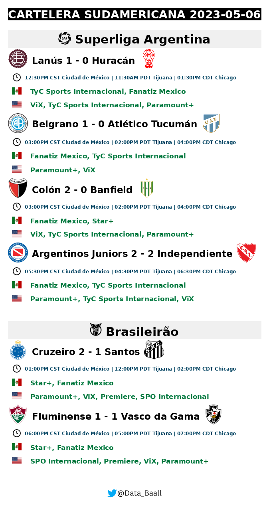
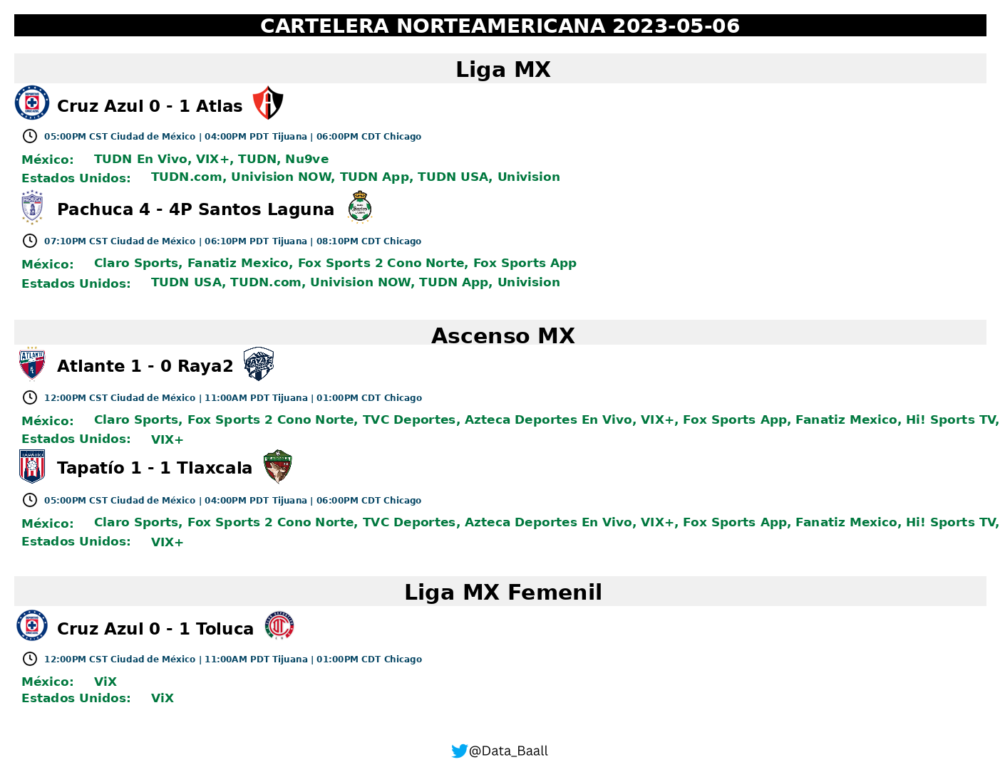
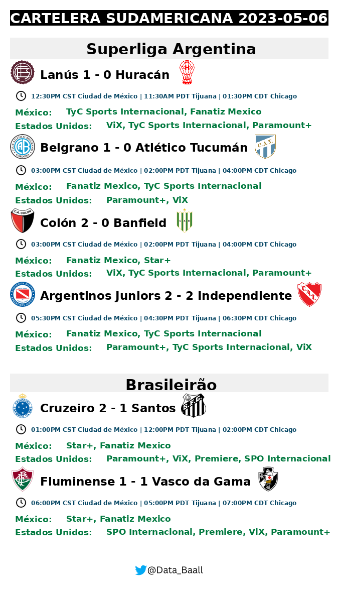

# Soccer Schedules

Soccer Schedules is a project that consists of doing Web Scraping to obtain the schedules and transmissions of the main soccer leagues. :tv::soccer:

## Description

This project aims to automate the process of obtaining the television stations in which the football matches will be broadcast, filter the information, generate an image and send it to a Telegram chat using a bot :robot:. By using web scraping techniques :spider:, the project extracts the necessary data from the target website and formats it into a visually appealing image. The generated image provides users with information about the available soccer broadcasts and the schedule.

## Features

 - :spider: Web scraping: The project utilizes web scraping techniques to extract relevant data from the target website.
 - :globe_with_meridians: Data filtering: Extracted data is filtered and processed to obtain specific information about football live streams.
 - :art: Image generation: The project generates visually appealing images containing the filtered data to provide an informative representation of available broadcasts.
 - :iphone: Send image: Sending the generated images to chat through a Telegram bot.

### Installation

 - Clone the repository to your local machine.
 - Install the required dependencies by running (It is recommended to previously create a *virtual environment*):
 
 
    pip install -r requirements.txt.

 -  Run the file init by command:
 

    python init.py

### Configuration
To configure the project, you need to:

 - You can customize the font path in settings.py file.
 - You can add images of the competitions and broadcasts countries. **NOTE:** The name of the images must match as in the database or change the name of the image in the variables ***r_competitions*** and ***r_countries*** in the db.py file. 
 - The images of the competitions must be uploaded in the *images/competitions* folder.
 - The images of the countries must be uploaded in the *images/flags* folder.
 - If you change any of the records in the db.py file you must run the init.py script again.
 - You can add the time zones you want in the settings file in the *TIMEZONES_FOR_IMAGE* variable
 - You can choose the language: Spanish or English for the generation of images in the settings file in the *LANGUAGE* variable

# Production
You can join the [Telegram Group](https://t.me/data_ball) where the broadcasts of the main soccer leagues are published.
Follow the [Twitter account](https://twitter.com/Data_Baall) where the images are posted.

# Results

### Images generated with images in the competitions and flags folders.

### Images generated without images in the competitions and flags folders.

